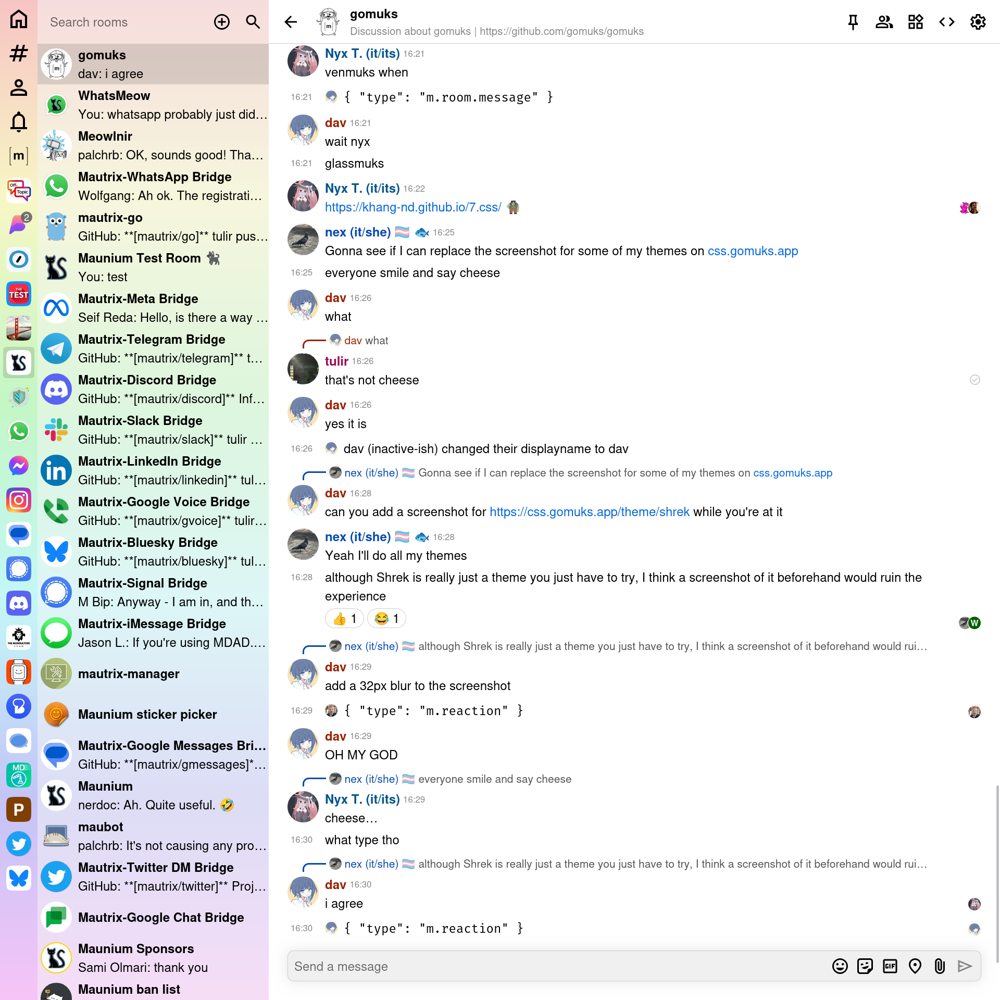

# gomuks

A Matrix client written in Go using [mautrix-go](https://github.com/mautrix/go).

gomuks is split into a backend and various frontends. The backend can either be
used as a traditional SDK that's built into the client, or as a remote server
which acts more like a bouncer.

* gomuks web is the most mature frontend and is ready for daily use. The web
  frontend also has various wrappers, like the [Android app](https://github.com/gomuks/android).
  There's also a version with an embedded backend in wasm.
* gomuks terminal is a port of legacy gomuks, but it's still experimental and
  doesn't have many features beyond basic chatting. A version with the backend
  embedded is planned, but doesn't exist yet ([#662](https://github.com/gomuks/gomuks/issues/662)).
  For legacy gomuks terminal, see the [v0.3.1 tag](https://github.com/gomuks/gomuks/releases/tag/v0.3.1)
  and <https://github.com/gomuks/gomuks/issues/476>.
* [Nexus](https://git.federated.nexus/Henry-Hiles/nexus) is a Flutter frontend
  that embeds the gomuks backend using the C FFI interface. It is currently in
  early development.

## Documentation
For installation and usage instructions, see [docs.mau.fi](https://docs.mau.fi/gomuks/).

## Discussion
Matrix room: [#gomuks:gomuks.app](https://matrix.to/#/#gomuks:gomuks.app)

## Preview (web)

